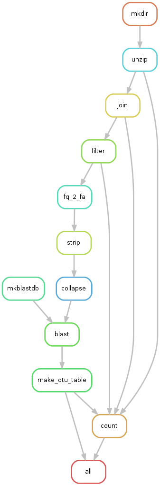
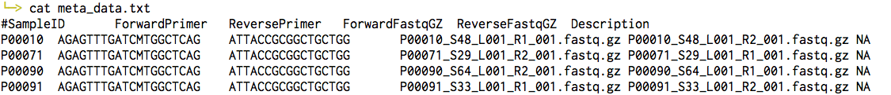

# Snakemake Microbiome Pipeline

## Download pipeline
```bash
git clone https://github.com/Wayne-Zen/SnaMP.git
```

## Load environment

```bash
module load python/anaconda
source activate /projects/academic/mjbuck/Buck_Lab_Members/wei/SnakeEnv
# source deactivate
```

## Workflow 0: baseline




### Usage

1. Load _baseline_ workflow.

  ```bash
  cd SnaMP
  ln -s workflows/baseline/* .
  ```

2. Prepare sequencing result.

  Repalce the `$SOURCE_FILES` with the __zipped__ sequencing result, e.g. `WHI_Repo/RT530_Batch2/*`

  ```bash
  cd link
  ln -s $SOURCE_FILES .
  cd ..
  ```

3. Build meta-data file.

  ```bash
  python build_meta.py -r V13
  ```

  _meta_data.txt_ is needed for specifying more detailed infomation about each sample.
  `build_meta.py` automatically generate _meta_data.txt_ by the following steps.
  
  * match up forward and reverse sequence files
  * head text before the first `_` in sequence file name will be used as _SampleID_, e.g. given _P00010_S48_L001_R1_001.fastq.gz_	and _P00010_S48_L001_R2_001.fastq.gz_, the _SampleID_ will identitied as _P00010_
  * set hyper-variable region selection by `-r`, choose from `V13` and `V34`
    * V13: fill _ForwardPrimer_ and _ReversePrimer_ with _AGAGTTTGATCMTGGCTCAG_ and _ATTACCGCGGCTGCTGG_
    * V34: fill _ForwardPrimer_ and _ReversePrimer_ with _CCTACGGGNGGCWGCAG_ and _GACTACHVGGGTATCTAATCC_

  A sample _meta_data.txt_:
  
  


4. Launch jobs.

  The pipeline will utilize CCR resource to parallel execution.
  OTU table and statisics about merge rate, filter rate, hit rate wiil be placed under _table_

  ```bash
  snakemake -p -j 100 --cluster-config cluster.json --cluster "sbatch --partition {cluster.partition} --time {cluster.time} --nodes {cluster.nodes} --ntasks-per-node {cluster.ntasks-per-node}"
  ```

### Database
Greengenes database is too big to be uploaded to github, so .tgz file is created.
