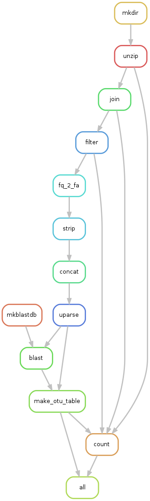

# Snakemake Microbiome Pipeline

## Download pipeline
```bash
git clone https://github.com/dmcskim/SnaMP.git
```

## Load environment

```bash
module load python/anaconda2-4.2.0
source activate /util/academic/python/anaconda/envs/py35
```

## Remove environment 

```
source deactivate
```

## Workflow 0: baseline

  * Closed reference OTU picking using BLAST
  * By default, use HOMD database


## Workflow 1: uparse

  * Denovo OTU picking using uparse
  * Annotate OTU taxonomy label by BLAST search
  * By default, use RDP database



### Usage

1. Load _baseline_ workflow

  Repalce the `$WORKFLOW` with the name of selected workflow, e.g. `baseline`

  ```bash
  cd SnaMP
  ln -s workflows/$WORKFLOW/* .
  ```

2. Prepare sequencing result

  Repalce the `$SOURCE_FILES` with the __zipped__ sequencing result, e.g. `WHI_Repo/RT530_Batch2/*`

  ```bash
  cd input
  ln -s $SOURCE_FILES .
  cd ..
  ```

3. Build meta-data file

  ```bash
  python tools/my-tools/build_meta.py -r V34
  ```

  _meta_data.txt_ is needed for specifying more detailed infomation about each sample.
  `build_meta.py` automatically generate _meta_data.txt_ by the following steps.
  
  * Match up forward and reverse sequence files
  * Use regex matching to determin sample id. Use () to indicate group. `python tools/my-tools/build_meta.py -h` for details.
  * Set hyper-variable region selection by `-r`, choose from `V13` and `V34`
    * V13: fill _ForwardPrimer_ and _ReversePrimer_ with _AGAGTTTGATCMTGGCTCAG_ and _ATTACCGCGGCTGCTGG_
    * V34: fill _ForwardPrimer_ and _ReversePrimer_ with _CCTACGGGNGGCWGCAG_ and _GACTACHVGGGTATCTAATCC_

  A sample _meta_data.txt_:
  
  


4. Launch jobs

  The pipeline will utilize CCR resource to parallel execution.
  OTU table and statisics about merge rate, filter rate, hit rate wiil be placed under _table_

  ```bash
  snakemake -p -j 100 --cluster-config cluster.json --cluster "sbatch --partition {cluster.partition} --time {cluster.time} --nodes {cluster.nodes} --ntasks-per-node {cluster.ntasks-per-node}"
  ```
  
5. Clean

  To remove generated files:
  ```
  snakemake clean
  ```
  
  To remove current workflow:
  
  ```
  snakemake unlink
  ```


## Known Issues

* empty sequence file
* RDP not uploaded to github
* cluster limit
